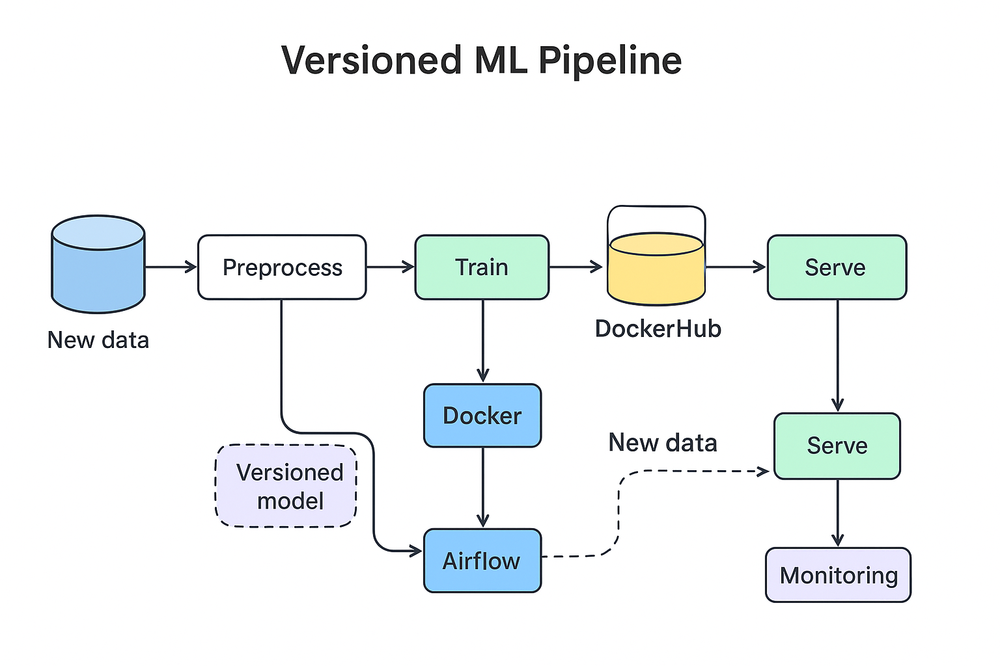

# Advanced MLOps Activity — Versioned ML Pipeline with Docker, Airflow & Container Registry

This repository contains starter code for the advanced class activity.

This activity builds on mlopsclassactivity1 to implement a production-like MLOps pipeline.

Students will:

Use Docker to containerize training & serving

Apply model versioning (v1, v2, …)

Automate retraining using Apache Airflow

Push images to DockerHub (or private registry)

Add basic monitoring & rollback mechanisms

# Versioned ML Pipeline

# Train a Versioned Model
python train.py v2 data/iris.csv data/new_data.csv
Saves model as model_v2.pkl

# Build & Push Docker Images
docker build -f Dockerfile.train -t <dockerhub-username>/ml-train:v2 .
docker push <dockerhub-username>/ml-train:v2

docker build -f Dockerfile.serve -t <dockerhub-username>/ml-api:v2 .
docker push <dockerhub-username>/ml-api:v2

# Run Serving Container
docker run -p 8000:8000 -e MODEL_PATH=model_v2.pkl <dockerhub-username>/ml-api:v2

# Test API Endpoint
curl -X POST "http://localhost:8000/predict" \
    -H "Content-Type: application/json" \
    -d '{"features": [5.1, 3.5, 1.4, 0.2]}'

Example response:

{"prediction": 0, "version": "model_v2.pkl"}

# Airflow DAG

Start Airflow:

airflow standalone

Copy dags/ml_pipeline_versioned.py into the dags/ folder.

Trigger DAG run. The DAG will:

Check for new_data.csv

Retrain & version model (v2, v3, …)

Build & push image

Deploy container

Rollback if accuracy is worse

# Monitoring

API logs request latency & errors

Returns model version in prediction response

# Deliverables

Students must submit:

Modified train.py, app.py, and Dockerfiles

Airflow DAG (ml_pipeline_versioned.py)

Screenshots of:

DockerHub with versioned images

Airflow DAG run logs

API predictions showing model version

Rollback demonstration
